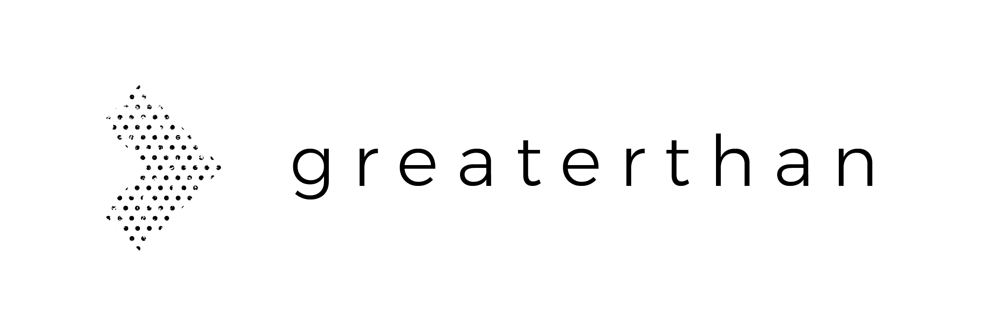

# About Greaterthan

## Collaborative Decision-Making that works

\*\*\*\*[**Greaterthan** ](http://greaterthan.works)trains, supports and advises teams and organizations at the forefront of decentralized, self-managed and participatory work. We use a variety of tools and practices to help these organizations face some of the biggest challenges related to power, money and governance.   
  
**Our mission** is to make self-management and participatory governance in organizations the new normal by spreading culture, knowledge and practices.   
  
**Our vision** is for a world where workplaces are communities that provide agency, personal growth and purpose . We believe that this will contribute to a system where value exchange is in balance.  

## Get in touch

If you have any questions, ideas, suggestions or would like to collaborate with us, do not hesitate to get in touch with any of our ****[**team members directly,**](https://www.greaterthan.works/#Team) or write to hello@greaterthan.works . 

