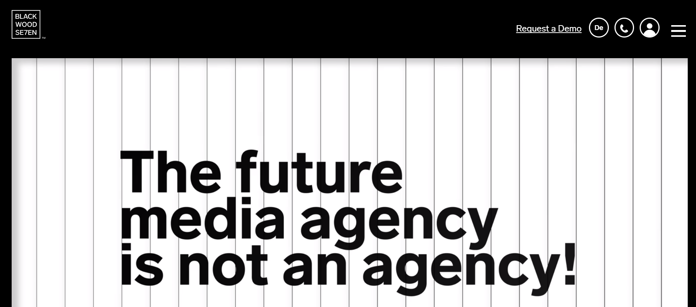

# Agile Team in BlackwoodSeven

[_Blackwood Seven_](https://blackwoodseven.com/) _is a marketing platform that uses artificial intelligence to help organisations get better results for their marketing spend. Their Barcelona team of 16 agile developers and people working in administration, human resources and communication has been using Cobudget._&#x20;

**How do they use Cobudget?** To be **** fully agile and make better financial decisions about everything related to their team, from office furniture, to team building activities, to which conferences to attend.

**What types of activities to they fund?** Team building activities, attending events, office expenses (tech, furniture, coffee machines etc.)

## **Total in funded buckets + €24,432 | Number of funded buckets: 20**

### **What do you use Cobudget for (what problem were you trying to solve?)**

We use it to buy office related stuff - from furniture to having team dinners. Basically all office needs that are above the very basics (e.g. cleaning supplies, utilities etc) - for instance we buy new tech equipment that each developer needs using Cobudget. We also fund people to attend conferences and travel for work.

Before we had Cobudget we just asked Daniela who does finance and admin if we could buy things or we got the credit card to do it.

With Cobudget we have freedom to decide where the group’s money goes and needs can be met in an easier way. We see that it’s in our power to use the money in a way that makes the most sense.

### **What are some of the most interesting or helpful buckets that you have seen?**

We moved into a new office at the start of the year and furnishing the office was causing a lot of stress - so we decided to put 75 percent of our monthly funds into the furniture bucket in order to get more team based decision making happening. So we did that and then we created a ‘furniture guild’. In this guild there was one delegate from each internal team. These delegates make decisions about where to spend the furniture bucket. Anyone interested could participate - anyone who didn’t care could trust the rest to take the best decision.

Before that we probably would have just got someone to decide it all for us (and maybe not have been that satisfied with what we got). Through this process we thought as a team rather than as individuals. Now the office reflects the team much more.

### **What advice would you give to an organisation starting out on the tool?**

Think as a team not as individuals and you will find that you get a better result. If people just try to take care of themselves they might find that they have less or the group collectively is not as strong.

&#x20; ****  \
****Also, try to make sure that the money showing in the tool is definitely the money that the group has available - that was the part we struggled with - we weren’t always quite sure if it matched up - this is a group process and admin problem rather than a problem with the tool but it’s important to get it right with your group.

### **In a world without Cobudget you would…**

Probably have just stuck with the old way of doing things. But with Cobudget we felt like it was a chance to see if we could put a lot of the work we had been doing forming as a team to the test. And we did.
