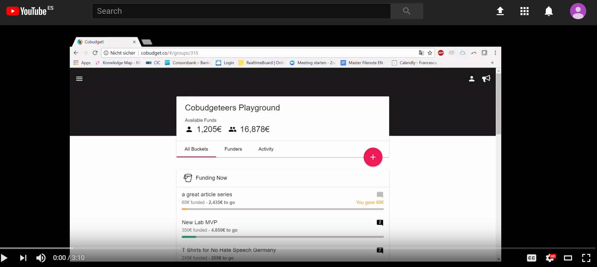

# Cobudget Basics

## How Cobudget works

* **Start a group** to collaboratively fund projects on Cobudget
* **Invite people** into your group
* **Create Buckets** to propose projects
* **Discuss bucket proposals** to improve them and get feedback from your group
* **Allocate funds** to the buckets you want to support


To get started,[ **watch this 3 min demo** ](https://www.loom.com/share/418dd9460b6a43ce9fb0227cd8efcf13)to discover the basic features of Cobudget.


### You are invited into a Cobudget group 

When you receive an invitation to join an existing Cobudget group, the email will contain a unique invitation link.

Click on the link in this email and complete your account setup, by adding your name. 

### Starting a new group 

You can start a new group from inside Cobudget by clicking on the **left nav bar and selecting "create group".** 

 Enter a group name, currency and click "Let's go!".

### Navigating Cobudget

You can see an overview of all buckets being proposed and funded on your main screen.

### Propose Buckets

Anyone in the group can make a bucket proposal, by **clicking on the big pink plus sign** on the left.

Fill out all the fields. You can edit your buckets anytime, but once you have moved it to funding, you can no longer edit the Funding Target. 

&gt;&gt; [Read more about writing and formating great buckets](guides-and-how-to/making-great-buckets/)

### Fund Buckets

You can fund buckets you like in one click with the amount you like. This cannot be undone. 

### See Your Group Activity

by selecting the tab "activity" on your main page. Here you can see your group totals, all transactions, funded buckets and download these as cvs files, for easier administration and accounting. 

## Want to learn more about features for admins? 

See our [**Group Admin Guide.**](guides-and-how-to/group-admin-guide.md)\*\*\*\*

