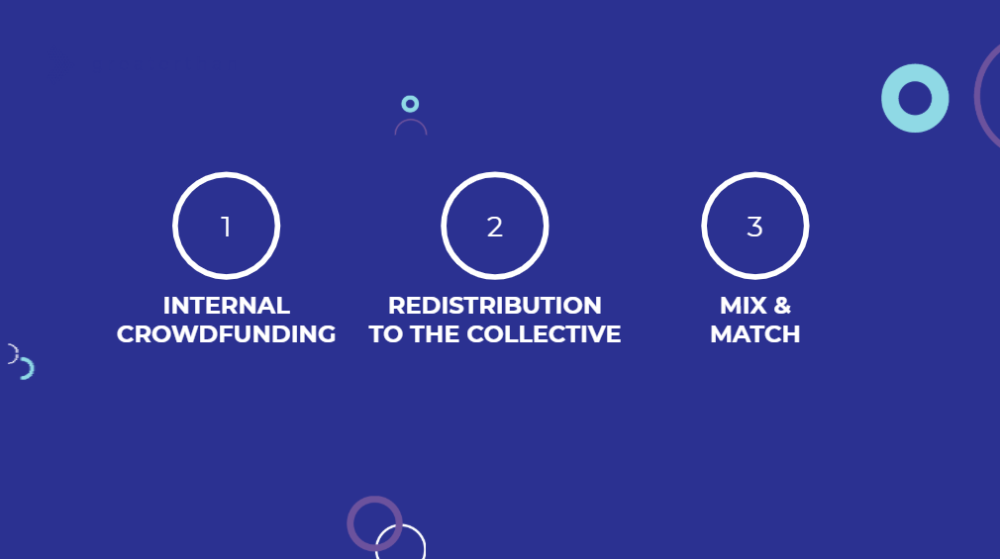

# Group Setup

## 1- Basic admin features

\*\*\*\*[**Watch this short demo video**](https://www.loom.com/share/dcfb7ed171484082a335bf26fca81f6d) that explains how to create and manage an new Cobudget group.

## 2 - Setting the parameters of your group

To be able to start using Cobudget in your group, you need to choose a Money governance model and operational process that connect with it. We've created a presentation to guide you through these steps and the different money governance options. 

\*\*\*\*[**&gt;&gt; See presentation**](https://www.slideshare.net/Greaterthanfinance/money-governance-models-for-cobudget)\*\*\*\*



Our our list of resources and templates for each phase of the Cobudget process have been created to help you with this step. 

[**&gt;&gt; Go to resources & templates**](cobudget-resources-and-templates.md#1-discovery)


To help you design and run great collaborative funding processes, we have created a **5-step participatory proposal guide**, to help you go further with onboarding, engagement, high quality proposal making and accountability. You can see it as [**guide.collaborativefunding.org**](https://guide.collaborativefunding.org/)\*\*\*\*


